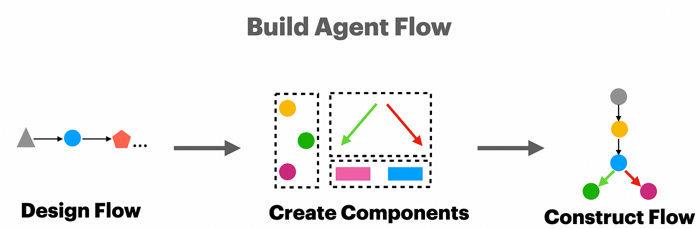
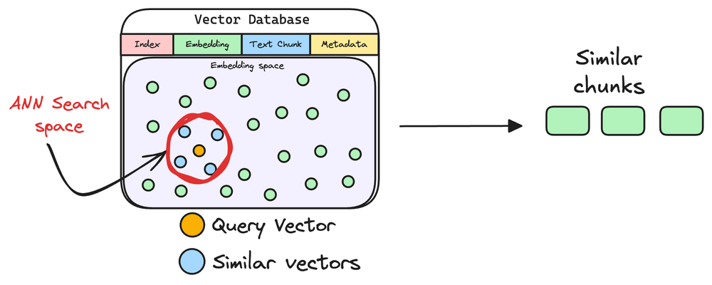
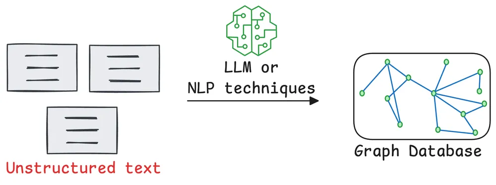
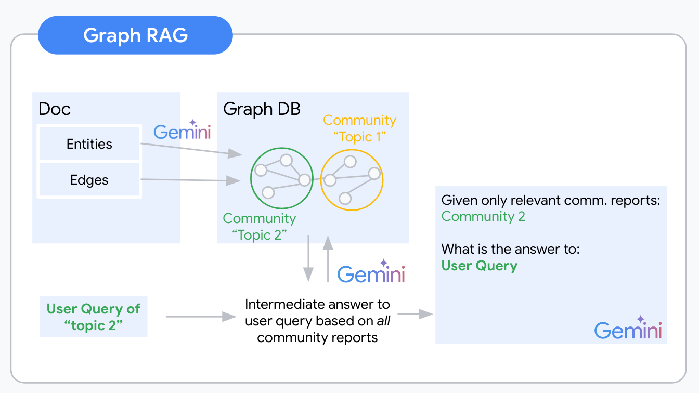

# Agent Knowledge and Applications

Agents are autonomous software entities capable of perceiving their environment, processing information, and taking actions to achieve specific goals. In artificial intelligence, agents play a key role in building intelligent systems that can interact, plan, respond, and collaborate with other agents or humans.

## Applications

### 1.  Bot Sale

( OpenAI Agents SDK + Guardrails input + Flow Agent(prompting) + Retrieval DB tool + RAG tool)

To run or modify the Bot Sale agent, navigate to the `bot_sale` directory.

**Click the image below to watch the demo video:**

[](https://youtu.be/Fvc_qRYzTWo)


### 2. Mathematical Reasoning Agent

( LangGraph + react + reflection + re-planning)

You can find the Jupyter Notebook for this agent here:  
[Mathematical Reasoning Agent Notebook](bot_sale/math_agent.ipynb)

## 🤖 Table of Contents

- [5 Agentic AI Design Patterns](#5-agentic-ai-design-patterns)
  - [1. Reflection Pattern](#1-reflection-pattern)  
  - [2. Tool Use Pattern](#2-tool-use-pattern)  
  - [3. ReAct (Reason and Act) Pattern](#3-react-reason-and-act-pattern)  
  - [4. Planning Pattern](#4-planning-pattern)  
  - [5. Multi-Agent Pattern](#5-multi-agent-pattern)  
- [Agent Concepts](#agent-concepts)  
  - [1. Routing (Hand-off)](#1-routing-hand-off)  
  - [2. Guardrails](#2-guardrails)  
  - [3. Flow Agent](#3-flow-agent)  
  - [4. AI Gateway](#4-ai-gateway)  
  - [5. Tracing](#5-tracing)  
  - [6. Streaming](#6-streaming)  
  - [7. Parallelization](#7-parallelization)  
  - [8. Human-in-the-loop](#8-human-in-the-loop)
- [MCP (Model Context Protocol)](#mcp-model-context-protocol)
- [Agent2Agent (A2A) Protocol](#agent2agent-a2a-protocol)
- [ACP (Agent Communication Protocol)](#acp-agent-communication-protocol)
- [Retrieval-Augmented Generation (RAG)](#retrieval-augmented-generation-rag)  
  - [1. Create chunks](#1-create-chunks)  
  - [2. Generate embeddings](#2-generate-embeddings)  
  - [3. Store embeddings in a vector database](#3-store-embeddings-in-a-vector-database)  
  - [4. User input query](#4-user-input-query)  
  - [5. Embed the query](#5-embed-the-query)  
  - [6. Retrieve similar chunks](#6-retrieve-similar-chunks)  
  - [7. Re-rank the chunks](#7-re-rank-the-chunks)  
  - [8. Chunking Methods](#8-chunking-methods)  
  - [9. Retrieval Techniques](#9-retrieval-techniques)  
  - [10. Cross-encoder and Bi-encoder](#10-cross-encoder-and-bi-encoder)  
  - [11. Graph RAG](#11-graph-rag)

## 5 Agentic AI Design Patterns

### 1. Reflection pattern


### 2. Tool use pattern


### 3. ReAct (Reason and Act) pattern


### 4. Planning pattern


### 5. Multi-agent pattern


## Agent Concepts

### 1. Routing (Hand-off)

Transferring tasks or control between agents to ensure seamless operation and fault tolerance.


### 2. Guardrails

Rules and constraints to keep agents operating safely, ethically, and reliably.


### 3. Flow Agent

Manages the sequence and logic of tasks or conversations within an agent system.




### 4. AI Gateway

Interface connecting clients to multiple AI services, handling routing, security, and scaling.


### 5. Tracing

Logging detailed agent activities for debugging and performance monitoring.


### 6. Streaming

Real-time continuous data flow processing between agents or systems.


### 7. Parallelization

Splitting tasks to run simultaneously across agents/processors for faster results.


### 8. Human-in-the-loop

Involving humans in agent decisions or training for safety and accuracy.


## MCP (Model Context Protocol)

The USB-C port equivalent for agentic systems.


Transport Mechanisms:

stdio: Communication over standard input/output streams

- The client and server receive JSON messages via stdin and respond via stdout

- Simplifies local process integration and debugging

- Well-suited for local servers like File, Git server, etc.


HTTP with Server-Sent Events (SSE):

- Establishes a bidirectional communication pattern over HTTP

- The server maintains an SSE connection for pushing messages to clients

- Clients send commands via standard HTTP POST requests

- Enables distributed architecture with multiple concurrent clients

- Better suited for hosted servers.


Further Reading on Model Context Protocol (MCP)

To deepen your understanding of the Model Context Protocol (MCP) and its applications, consider exploring the following resources:

- [What is Model Context Protocol (MCP): Explained](https://composio.dev/blog/what-is-model-context-protocol-mcp-explained/)

- [Building an MCP Server from Scratch](https://dshills.medium.com/building-an-mcp-server-from-scratch-432f600b5e68)

## Agent2Agent (A2A) Protocol

- MCP provides agents with access to tools.

- While A2A allows agents to connect with other agents and collaborate in teams.


The A2A protocol is built upon established web standards, primarily using JSON-RPC 2.0 over HTTP(S) for request/response interactions and Server-Sent Events (SSE) for streaming.

- A2A-supporting Remote Agents must publish a "JSON Agent Card" detailing their capabilities and authentication.

- Clients use this to find and communicate with the best agent for a task.


Example `JSON Agent Card` Structure:
```
{
  "name": "Image Generation Agent",
  "description": "Generates images based on text prompts.",
  "url": "https://api.example-image-agent.com/a2a",
  "version": "1.0.0",
  "capabilities": {
    "streaming": true,
    "pushNotifications": false,
    "stateTransitionHistory": true
  },
  "authentication": {
    "schemes": ["apiKey"]
  },
  "defaultInputModes": ["text"],
  "defaultOutputModes": ["image/png"],
  "skills": [
    {
      "id": "generate_image",
      "name": "Generate Image",
      "description": "Creates an image from a textual description.",
      "inputModes": ["text"],
      "outputModes": ["image/png"],
      "examples": ["Generate an image of a 'blue cat wearing a top hat'"]
    }
  ]
}
```


Further Reading on Agent2Agent (A2A) Protocol

To deepen your understanding of the Agent2Agent (A2A) protocol and its applications, consider exploring the following resources:

- [Building Multi-Agent AI App with Google's A2A Protocol, ADK, and MCP](https://medium.com/ai-cloud-lab/building-multi-agent-ai-app-with-googles-a2a-agent2agent-protocol-adk-and-mcp-a-deep-a94de2237200)

- [What is The Agent2Agent Protocol (A2A) and Why You Must Learn It Now](https://huggingface.co/blog/lynn-mikami/agent2agent)

## ACP (Agent Communication Protocol)

Agent Communication Protocol (ACP) is a more generalized framework for managing structured dialogue between agents. Think of it as the broad umbrella under which other protocols like A2A may reside.


Key Features of ACP:  

- Message Standardization: Uses speech-act theory (e.g., INFORM, QUERY, REQUEST) to standardize communication.
- Ontology Support: Agents share a common vocabulary, reducing ambiguity.
- Error Handling: Includes robust exception management and message validation.
- Agent Registry Services: Agents can register capabilities and discover others through directory facilitators.

ACP is widely used in environments with heterogeneous AI systems, often orchestrated by an AI agents development company to build scalable, distributed platforms where different agents (like recommendation engines, fraud detectors, and monitoring bots) coexist and collaborate.

MCP vs A2A vs ACP: A Comparative Breakdown


Protocols Compared Side-by-Side:


Choosing the Right Protocol for Your AI Stack  
When building or scaling an AI agents communication architecture, your choice among MCP, A2A, and ACP depends on your specific needs:

- Choose MCP if your AI agents rely heavily on context, history, and personalized interactions. Ideal for recommendation systems, personalized assistants, or healthcare AI agents.
- Choose A2A for environments requiring distributed decision-making or multi-agent coordination. Best for supply chains, financial systems, or robotic swarms.
- Choose ACP when you need a common language and messaging standard across a wide range of agents, particularly in complex enterprise environments.

For example, a smart hospital system might use MCP for patient context sharing, A2A for real-time coordination between diagnostic bots, and ACP as the overarching communication framework.

Further Reading on Agent Communication Protocol (ACP)

To better understand the Agent Communication Protocol (ACP) and its role in multi-agent systems, explore the following resources:

- [MCP vs A2A vs ACP - Agent Communication Protocols](https://www.bluebash.co/blog/mcp-vs-a2a-vs-acp-agent-communication-protocols/)

- [What Every AI Engineer Should Know About A2A, MCP, and ACP](https://medium.com/@elisowski/what-every-ai-engineer-should-know-about-a2a-mcp-acp-8335a210a742)

# Retrieval-Augmented Generation (RAG)

## Workflow of a RAG System


### 1. Create chunks


### 2. Generate embeddings


### 3. Store embeddings in a vector database


### 4. User input query


### 5. Embed the query


### 6. Retrieve similar chunks




### 7. Re-rank the chunks


### 8. Chunking Methods


Further Reading on Chunking Strategies for RAG

- [5 Chunking Strategies for RAG](https://blog.dailydoseofds.com/p/5-chunking-strategies-for-rag?ref=dailydoseofds.com)

### 9. Retrieval Techniques

- Keyword Matching (Sparse Vector Search): Uses lexical matching with TF-IDF, BM25.

- Dense Vector Search: Employs transformer-based embeddings for semantic similarity via Approximate Nearest Neighbor (ANN) search in dense vector spaces.

- Hybrid Retrieval: Combines sparse (BM25) and dense (embedding) retrieval to balance precision and recall, enhancing relevance and robustness.

| Feature               | Sparse Vectors                                    | Dense Vectors                                      |
|-----------------------|--------------------------------------------------|---------------------------------------------------|
| Data Representation   | Majority of elements are zero                     | All elements are non-zero                          |
| Computational Efficiency | Generally higher, especially in operations involving zero elements | Lower, as operations are performed on all elements |
| Information Density   | Less dense, focuses on key features               | Highly dense, capturing nuanced relationships     |
| Example Applications  | Text search, Hybrid search                         | RAG, many general machine learning tasks          |


Mixing or fusion

You can mix the results from both dense and sparse vectors, based purely on their relative scores. This is a simple and effective approach, but it doesn’t take into account the semantic similarity between the results. Among the popular mixing methods are:

- Reciprocal Ranked Fusion (RRF)
- Relative Score Fusion (RSF)
- Distribution-Based Score Fusion (DBSF)


Further Reading on Sparse Vectors

- [What is a Sparse Vector? How to Achieve Vector-based Hybrid Search](https://qdrant.tech/articles/sparse-vectors/)

### 10. Cross-encoder and Bi-encoder

Cross-Encoder is a deep learning model that jointly encodes both the query and document to directly assess their relevance by capturing fine-grained interactions between them.

It’s commonly used for re-ranking because:

- It provides higher accuracy by modeling detailed query-document interactions.

- It’s computationally expensive, so it’s applied to a small set of retrieved candidates.

- It improves final result quality by filtering out less relevant items.


Bi-Encoder independently encodes the query and document into separate embeddings, then measures relevance using similarity metrics like cosine similarity.

It’s often used for initial retrieval because:

- It enables efficient large-scale search by precomputing document embeddings.

- It allows fast approximate nearest neighbor (ANN) search.

- It’s less accurate than cross-encoder but much faster, suitable for filtering large collections before re-ranking.


### 11. Graph RAG






